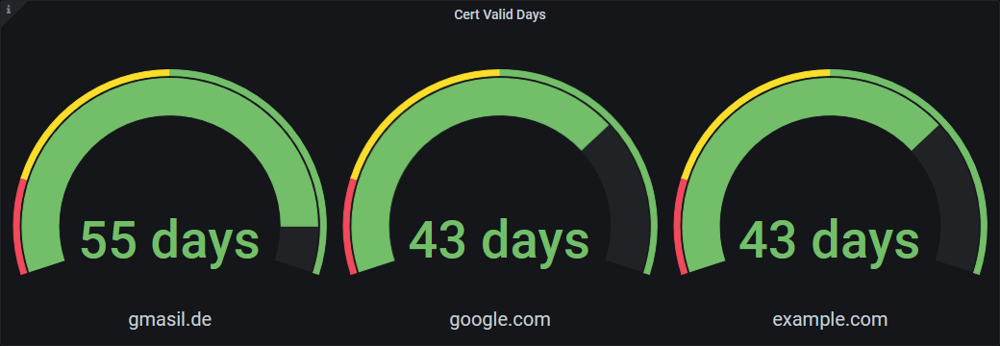

# Certificate-Exporter

This is a simple prometheus exporter to provide metrics when TLS certificates will expire.

It is based on netcat for serving web request and openssl to download and read certificates.

# Example

The exporter will start a webserver on port 80 (no HTTPS/TLS) and provide its metrics under every URI. The exporter checks all domains you specify in the environment variable `DOMAINS` and just output the amount of days until the certificate will become invalid. Then you visualize the data in a nice gauge for example with grafana:



Here you can see an example output of the certificate-exporter:

```
# HELP cert_days_remaining Days until the certificate becomes invalid
# TYPE cert_days_remaining gauge
cert_days_remaining{domain="gmasil.de"} 55
cert_days_remaining{domain="google.com"} 43
cert_days_remaining{domain="example.com"} 43
```

# Build

Build simply with docker:

```bash
docker build .
```

Build with Compose:

```bash
docker-compose build
```

**Note:** this will build an image called `registry.gmasil.de/docker/cert-exporter`, this is my own docker registry.

# Usage

You can use the image I uploaded to my docker registry, if you want to use your own build just replace the image name accordingly.

The certificate-exporter will **listen** on **port 80** and exposes it by default.

You can specify which domains you want to monitor by providing a **comma separated list of domains** in the environment variable `DOMAINS`.

Usage with docker:

```bash
docker run -p 80:80 -e "DOMAINS=google.com,example.com" registry.gmasil.de/docker/cert-exporter:1.0
```

Example docker-compose file:

```bash
version: '3'

services:
  certexporter:
    image: registry.gmasil.de/docker/cert-exporter:1.0
    environment:
      - "DOMAINS=google.com,example.com"
```

## Prometheus

In your `prometheus.yml` you can add the certificate-exporter like this:

```yml
global:
  scrape_interval: 15s
  evaluation_interval: 15s

scrape_configs:
  - job_name: "certexporter"
    static_configs:
      - targets:
          - certexporter:80
```

**Note:** As the certificate-exporter will provide the metrics on all URIs, you can leave all defaults like scraping on the `/metrics` URI.

## License

[GNU GPL v3 License](LICENSE.md)

Certificate-Exporter is free software: you can redistribute it and/or modify  
it under the terms of the GNU General Public License as published by  
the Free Software Foundation, either version 3 of the License, or  
(at your option) any later version.

Certificate-Exporter is distributed in the hope that it will be useful,  
but WITHOUT ANY WARRANTY; without even the implied warranty of  
MERCHANTABILITY or FITNESS FOR A PARTICULAR PURPOSE. See the  
GNU General Public License for more details.
